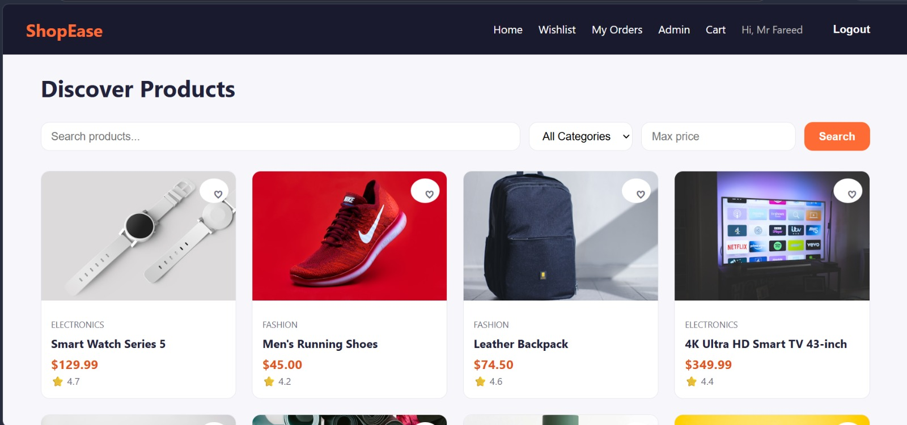
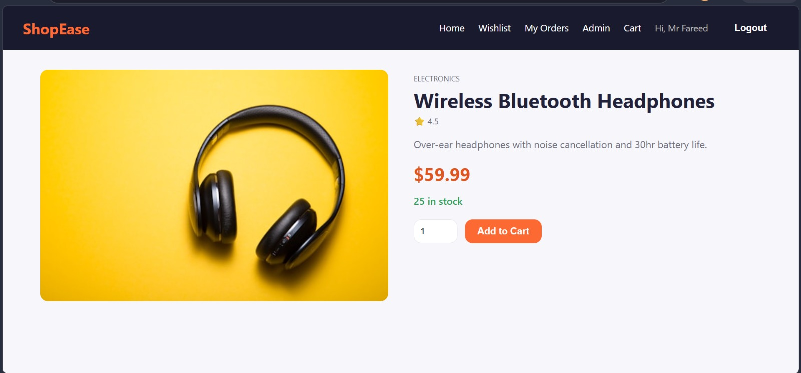
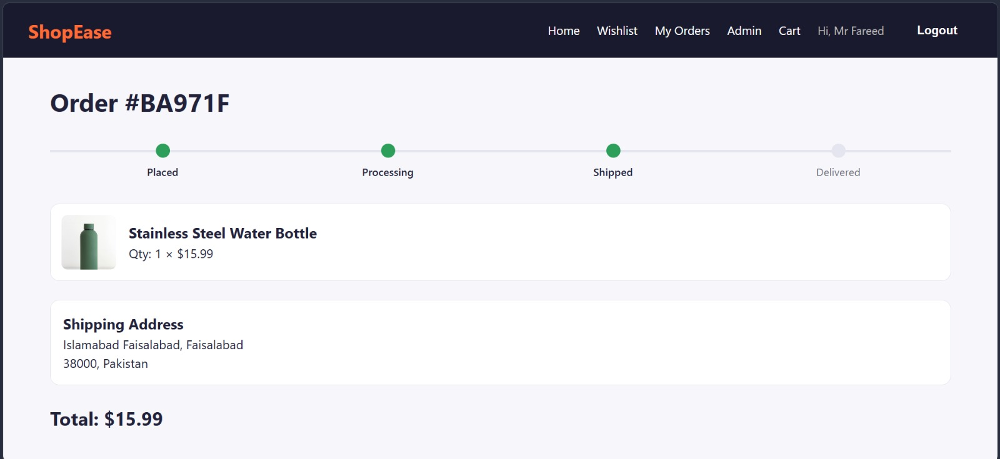
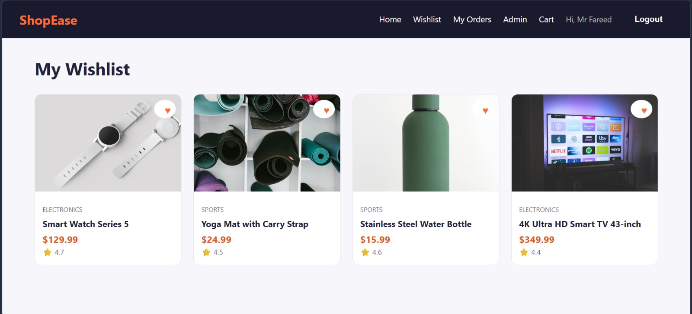
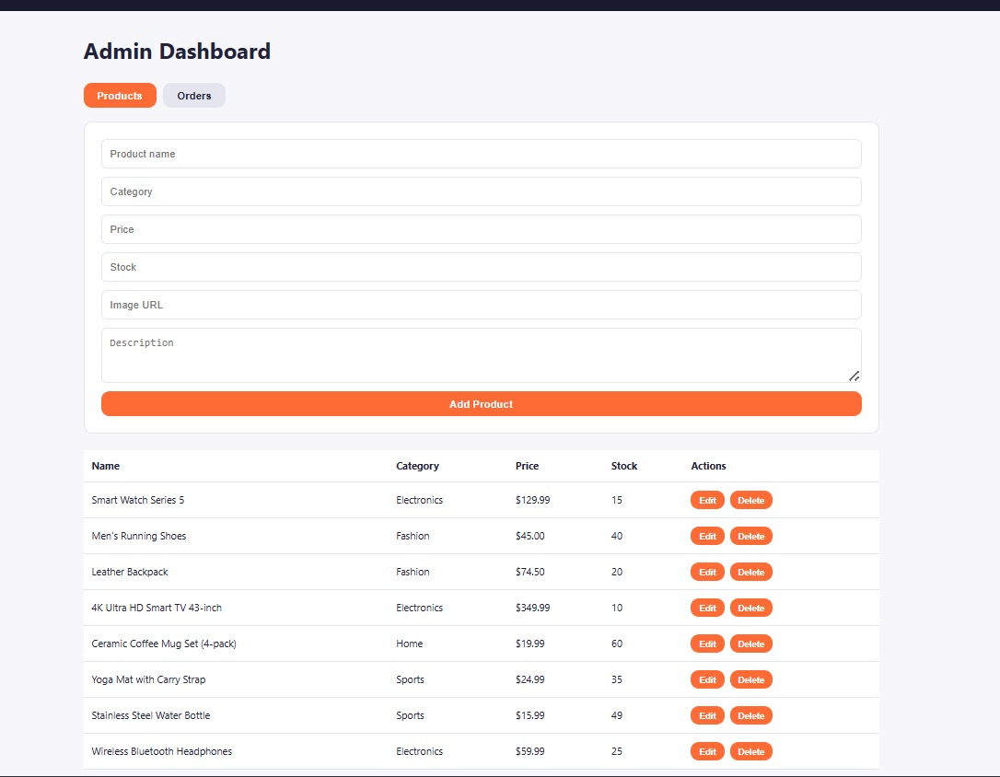

# ShopEase — Full Stack E-commerce Store

A full-featured e-commerce web application built as **Task 1** for the **CodeAlpha Full Stack Development Internship**.

Built with the **MERN stack** (MongoDB, Express.js, React, Node.js).

## 🚀 Live Demo
- Frontend: _add your deployed link here (Vercel/Netlify)_
- Backend API: _add your deployed link here (Render/Railway)_

## ✨ Features

- 🔐 **User Authentication** — register/login with JWT, hashed passwords (bcrypt)
- 🛍️ **Product Catalog** — browse products with images, ratings, stock status
- 🔎 **Search & Filter** — full-text search, filter by category and max price
- ❤️ **Wishlist** — save products to revisit later
- 🛒 **Shopping Cart** — persistent cart (localStorage), quantity control
- 📦 **Order Placement & Tracking** — checkout flow with a visual order-status tracker (Placed → Processing → Shipped → Delivered)
- 🛠️ **Admin Dashboard** — add/edit/delete products, update order statuses
- 📱 **Responsive Design** — works on mobile and desktop

## 🧱 Tech Stack

**Frontend:** React (Vite), React Router, Axios, custom CSS
**Backend:** Node.js, Express.js, MongoDB, Mongoose, JWT, bcrypt.js

## 📁 Project Structure

```
CodeAlpha_Ecommerce/
├── backend/
│   ├── config/        # Database connection
│   ├── controllers/   # Route logic (auth, products, orders)
│   ├── middleware/     # JWT auth + admin guard
│   ├── models/         # Mongoose schemas
│   ├── routes/          # Express routers
│   ├── seed/            # Sample product seeder
│   └── server.js
└── frontend/
    └── src/
        ├── api/          # Axios instance
        ├── components/   # Navbar, ProductCard, ProtectedRoute
        ├── context/      # Auth & Cart global state
        └── pages/        # Home, Product, Cart, Checkout, Orders, Admin...
```

## ⚙️ Setup Instructions

### 1. Backend

```bash
cd backend
npm install
cp .env.example .env
# then edit .env and add your MongoDB URI + JWT secret
npm run seed     # populates sample products
npm run dev
```

Backend runs on `http://localhost:5000`.

### 2. Frontend

```bash
cd frontend
npm install
npm run dev
```

Frontend runs on `http://localhost:5173` and proxies `/api` requests to the backend.

### 3. Make yourself an admin (optional)

To access the Admin Dashboard, register a normal account, then manually set `isAdmin: true` for your user in MongoDB (via MongoDB Compass or Atlas).

## 📸 Screenshots

### Home Page 
### Product Details  
### Order Tracking  
### Wishlist  
### Admin Dashboard 
## 🎥 Demo Video

_Add your LinkedIn video walkthrough link here._

---

Built for the **CodeAlpha Full Stack Development Internship** — Task 1: Simple E-commerce Store.
